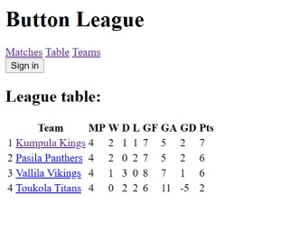
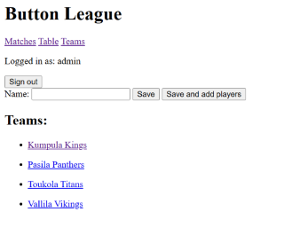

# Button League

Button league is a web application for managing a football league. Users can see view played and upcoming matches, the league table and the teams and players. After logging in with an admin account you can manage the matches, teams and players. You can record scores of the matches after which the application calculates the league table accordingly.






## Built with
* Java
* Spring Boot
* Thymeleaf
* Maven
* JavaScript
* Database
    - H2 database for local testing and development.
    - Postgres used for deployment.

## Getting started

### Prerequisites
* Java JDK
* Maven

### Installing and starting the application
1. Clone the project:

    ```
    git clone https://github.com/ollimyy/button-league button_league
    cd button_league
    ```
2. Build the project:

   `mvn clean install`

3. Start the application

    `mvn spring-boot:run`

4. The application should now be available at http://localhost:8080.
    - `admin` user available with password `admin`.
    - Sample data in database for testing.
    - Database can be accessed from endpoint [`/h2-console`](http://localhost:8080/h2-console) with JDBC URL: `jdbc:h2:mem:buttonleague`.

